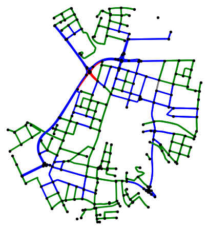

# Project Summary: Graph Machine Learning for Road Network Analysis

This is the final project for the Machine Learning on Graphs course done in collaboration with Jovana Videnović and Jaša Žnidar. For a detailed analysis of our project check out this [blog](https://medium.com/@jz6042/ac09a20294bf) or [notebook](https://github.com/gasperkreft/MLG_FinalProject/blob/main/ProjectMLG.ipynb)

## Introduction

The OpenStreetMap platform allows users worldwide to collaboratively create and update road network maps. However, with contributions from various sources, errors and missing data can occur, leading to unreliable information, especially in areas with limited coverage. Our project addresses these challenges by leveraging Graph Neural Networks (GNNs) to analyze the road network and predict unknown features.

  
  

On the left picture you can see actual speed limits in center district of Ljubljana and on the right the predicted ones.

## Project Structure

1. **What is OpenStreetMap, and What We Did with It?**
   - An introduction to OpenStreetMap and its significance in modern urban planning.
   - Our goal of improving OSM accuracy through GNN-based feature prediction.
   - Focus on three crucial features: road type, lane count, and maximum speed prediction.

2. **Using NetworkX for Road Network Analysis**
   - The power of NetworkX Python library for studying complex networks like road networks.
   - Insights gained through average node degree, closeness centrality, and betweenness centrality analysis.
   - Illustrative examples showcasing essential intersections and nodes.

3. **Graph Structure, Feature Analysis, and Transformations**
   - Converting the road network to a graph format for GNNs.
   - Calculating an angle between roads to recover some lost geospatial information.
   - Analyzing node features, including length, max speed, road type, oneway, and lanes.

4. **Graph Neural Networks (GNNs) for Feature Prediction**
   - Understanding GNNs as a powerful tool for processing graph data.
   - Comparison of three GNN architectures used: Graph Convolutional Networks (GCNs), GraphSAGE, and Graph Attention Networks (GATs).
   - Evaluating models for road type, lane count, and maximum speed prediction.

5. **Results and Insights**
   - Evaluation metrics, including classification accuracy and macro-average F1 score.
   - Performance of models with and without undersampling for imbalanced datasets.
   - Model predictions on unlabelled data and real-world application.

6. **Conclusion**
   - Successes and implications of our project for transportation forecasting and optimization.
   - The potential of GNNs for road network analysis and future research directions.

Our project combines cutting-edge graph machine learning techniques with the real-world data of Ljubljana's road network. The insights gained have the potential to revolutionize transportation planning and create safer, more efficient cities. Further research and larger datasets will continue to drive advancements in this exciting field.
